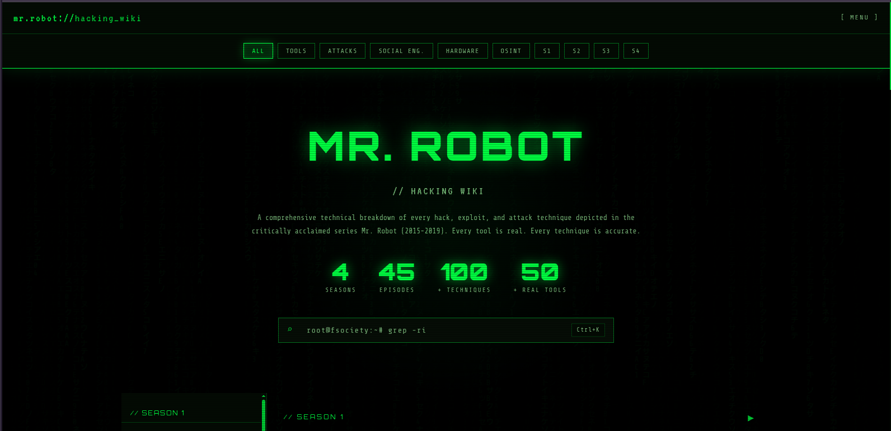
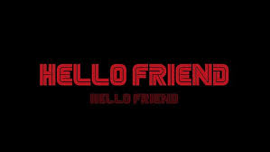

# 🔓 MR. ROBOT // HACKING WIKI

**A comprehensive technical breakdown of every hack, exploit, and attack technique depicted in the critically acclaimed series Mr. Robot. Every tool is real. Every technique is accurate.**

[](https://ahx47.github.io/mr.robot-WIKI/)

## 🌐 Live Preview

The website is deployed and accessible at: [https://ahx47.github.io/mr.robot-WIKI/](https://ahx47.github.io/mr.robot-WIKI/)



> **Note**: If the iframe does not load automatically, please [click here](https://ahx47.github.io/mr.robot-WIKI/) to open the page directly.

## 📖 About the Project

This static, single‑file HTML website catalogs every major hack, vulnerability, and cybersecurity technique from *Mr. Robot* (2015‑2019). It breaks down each episode into real attack chains – from the 5/9 cryptoworm and femtocell IMSI catchers to SS7 exploitation and UPS firmware thermal runaway.

### 🎯 Key Features

* **45+ episodes** across 4 seasons
* **100+ hacking techniques** with command‑line examples
* **50+ real tools** (Kali, Metasploit, aircrack‑ng, Proxmark3, OpenBTS, etc.)
* Expandable episode cards, live search, and category filters (Tools, Attacks, Social Eng., Hardware, OSINT)
* Copy‑able code blocks, Matrix rain background, and a retro terminal aesthetic

## ⚔️ Major Hacks & Techniques Featured

| Hack / Technique | Season | Description |
|-----------------|--------|-------------|
| **The 5/9 Hack** | 1 & 2 | A coordinated ransomware attack that encrypted 70% of global consumer debt records |
| **Femtocell IMSI Catcher** | 2 & 3 | Modified cell tower device to intercept all nearby mobile communications; used inside the FBI field office |
| **USB Rubber Ducky** | 2, 3 & 4 | USB device emulating a keyboard to execute pre‑programmed keystroke attacks (e.g., dumping passwords with Mimikatz) |
| **Tor Exit Node Traffic Analysis** | 1 | Running a Tor exit node to observe unencrypted traffic leaving the Tor network |
| **SS7 Exploitation** | 3 & 4 | Abusing the SS7 protocol (designed with no authentication) to intercept calls, SMS (including 2FA), and track locations |
| **Rootkit & Process Hiding** | 1 & 2 | Kernel‑level rootkits hooking sys_getdents and using DKOM to hide malicious processes from the task list |
| **RUDY DDoS Attack** | 1 | Layer 7 DDoS using HTTP POST with long Content‑Length, exhausting server thread pools |
| **Bluetooth Exploitation** | 1 | Bluesnarfing/Bluebugging against Android phones using Kali Bluetooth tools |
| **DeepSound Steganography** | 1 | Hiding stolen data inside WAV/FLAC audio files (disguised as music CDs) |
| **Linux Privilege Escalation** | 1 & 2 | Using kernel exploits (Dirty COW), SUID binaries, writable cron scripts, and world‑writable /etc/passwd |
| **WPA2 Wi‑Fi Cracking** | 1 | Capturing the 4‑way handshake with a deauthentication attack and cracking offline with rockyou.txt |
| **IoT / Smart Home Hijack** | 2 | Taking over a smart home via default IoT credentials and UPnP exploitation |
| **Logic Bomb** | 2 | Malicious code dormant until a trigger condition is met (e.g., date‑based activation) |
| **DNS Tunneling** | 3 | Exfiltrating data by encoding it within DNS queries to bypass firewalls |
| **Supply Chain Attack** | 3 | Intercepting UPS firmware during the update pipeline (foreshadowing the 2020 SolarWinds attack) |
| **VM & Sandbox Detection** | 4 | Checking MAC prefixes, processes (vmtoolsd), registry keys, and CPUID hypervisor bits to evade analysis |
| **Physical Pentesting** | 4 | Near‑silent physical intrusion: RFID cloning with Proxmark3, passive network taps (Throwing Star LAN Tap), booting from external media |
| **The Deus Group Hack** | 4 | Multi‑stage operation: OSINT financial mapping, SWIFT network compromise, vishing (voice phishing), SS7‑based 2FA bypass, and crypto laundering (Bitcoin tumblers + Monero) |
| **Air‑Gapped Network Breach** | 4 | Using USB bridging and TEMPEST side‑channels, as shown in the series finale |

## 🛠️ Tools Used

The website catalogs real tools from the show, including:

- **Kali Linux** – The primary operating system used by fsociety
- **Metasploit / Meterpreter** – For exploitation and post‑exploitation
- **Aircrack‑ng** – For Wi‑Fi auditing and WPA/WPA2 cracking
- **Proxmark3** – For RFID cloning (e.g., HID iClass, MIFARE, EM4100)
- **OpenBTS / USRP / YateBTS** – For building rogue femtocells and SDR‑based attacks
- **USB Rubber Ducky** – For keystroke injection attacks
- **Hashcat / John the Ripper / CUPP** – For password cracking
- **Social Engineer Toolkit (SET)** – For phishing and SMS spoofing
- **Wireshark / tcpdump** – For packet analysis
- **DeepSound** – For audio‑based steganography
- **Nmap** – For network reconnaissance
- **Shodan** – For IoT device discovery
- **Volatility** – For memory forensics and rootkit detection
- **dnscat2 / iodine** – For DNS tunneling exfiltration
- **AndroRAT** – For Android remote access
- **BACnet / Modbus / DNP3** – For SCADA/ICS attacks

## 📁 Repository Structure

```
mr.robot-WIKI/
├── index.html          # The complete, self‑contained website
└── README.md           # This file
```

## 🔧 Local Development

To run the website locally:

1. Clone the repository:
   ```bash
   git clone https://github.com/ahx47/mr.robot-WIKI.git
   cd mr.robot-WIKI
   ```
2. Open `index.html` in any modern web browser (no build steps or dependencies required).

> The site uses Google Fonts and jQuery CDN; an internet connection is required for those external resources.

## 🚀 Deployment

This site is deployed using **GitHub Pages** with a GitHub Actions workflow that automatically deploys on every push to the `main` branch. The live version is always available at:  
👉 [https://ahx47.github.io/mr.robot-WIKI/](https://ahx47.github.io/mr.robot-WIKI/)

## 📝 License & Disclaimer

**⚠️ DISCLAIMER:** This project is for **educational and research purposes only**. The techniques and tools described are based on the fictional TV series *Mr. Robot* and are intended to illustrate real‑world cybersecurity concepts. Do not use any of the information for unauthorized access or illegal activities. The author and contributors assume no liability for any misuse of this material.

## 🙏 Acknowledgements

- **Ryan Kazanciyan** (CrowdStrike/Tanium) – Technical advisor for the series
- **Kor Adana** – Writer and technical consultant
- **Marc Rogers** (DEF CON) – Cybersecurity expert
- **Sam Esmail** – Creator of *Mr. Robot*
- All the security professionals who made the show's hacking scenes technically accurate

## 📬 Contact & Contributions

Contributions to improve the wiki (e.g., adding more techniques, fixing inaccuracies, or enhancing the interface) are welcome! Please open an issue or submit a pull request.

---

*"Hello, friend." — Elliot Alderson & Abdo_hak47 *

```

